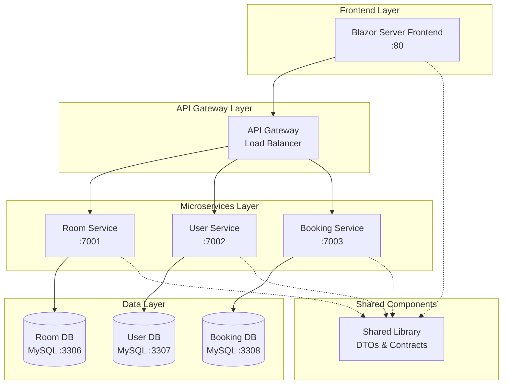

# 🏢 Room Management System


> **📚 Academic Project:** Dieses Projekt wurde ausschließlich für den Kurs "Containerisierung und Orchestrierung von Microservices" entwickelt und demonstriert moderne Cloud-Native Entwicklungspraktiken.

## 🌟 Projektübersicht

Das Room Management System ist eine hochmoderne, cloud-native Webanwendung zur intelligenten Verwaltung von Räumen, Benutzern und Buchungen in Bildungseinrichtungen. Das System implementiert eine vollständige Microservice-Architektur mit containerisierter Bereitstellung und Kubernetes-Orchestrierung.

### 🎯 Kernfunktionalitäten

- **🏢 Intelligente Raumverwaltung** - Dynamische Verwaltung von Räumen mit Typisierung und Kapazitätsoptimierung
- **👥 Benutzeradministration** - Umfassende Verwaltung von Studenten und Professoren
- **📅 Intelligentes Buchungssystem** - Zeitbasierte Reservierungen mit automatischer Konfliktprüfung
- **📊 Real-time Dashboard** - Live-Statistiken und Performance-Metriken
- **📁 Excel-Integration** - Massenimport und -export von Daten

## 🏗️ Systemarchitektur

### Microservices-Topologie



### 📁 Projektstruktur

```
RoomManagementSystem/
├── 🖥️ RoomManagement.Frontend/          # Blazor Server UI
│   ├── Components/                       # Reusable UI Components
│   ├── Services/                        # HTTP Client Services
│   └── Pages/                           # Application Pages
├── 🏢 RoomManager.RoomService/          # Room Management API
│   ├── Controllers/                     # REST API Controllers
│   ├── Services/                        # Business Logic
│   ├── Repositories/                    # Data Access Layer
│   └── Models/                          # Domain Models
├── 👥 RoomManager.UserService/          # User Management API
│   ├── Controllers/                     # User & Professor APIs
│   ├── Services/                        # User Business Logic
│   └── Data/                           # EF Core Context
├── 📅 RoomManager.BookingService/       # Booking Management API
│   ├── Controllers/                     # Booking REST APIs
│   ├── Services/                        # Booking Logic
│   └── Validation/                     # Business Rules
├── 📦 RoomManager.Shared/               # Shared Contracts
│   ├── DTOs/                           # Data Transfer Objects
│   ├── Requests/                       # API Request Models
│   └── Responses/                      # API Response Models
├── 🧪 RoomManagement.Tests/             # Unit & Integration Tests
├── 🐳 docker-compose.yml               # Container Orchestration
├── ☸️ k8s/                             # Kubernetes Manifests
│   ├── deployments/                    # Service Deployments
│   ├── services/                       # Service Definitions
│   └── configmaps/                     # Configuration
└── 📋 docs/                            # Project Documentation
```

## 🚀 Technologie-Stack

### Core Framework
-  **ASP.NET Core 9.0** - High-performance web framework
-  **Blazor Server** - Interactive web UI framework

### Frontend & UI
-  **Radzen Blazor Components** - Professional UI component library
-  **Bootstrap 5** - Responsive CSS framework
-  **Modern JavaScript** - Client-side interactivity

### Backend & APIs
-  **ASP.NET Core Web API** - RESTful service framework
-  **Entity Framework Core** - Object-relational mapping
-  **OpenAPI/Swagger** - API documentation

### Database & Storage
-  **MySQL 8.0** - Relational database
-  **Pomelo MySQL Provider** - EF Core MySQL driver

### DevOps & Containerization
-  **Docker** - Container platform
-  **Docker Compose** - Multi-container orchestration
-  **Kubernetes** - Container orchestration
-  **Helm** - Kubernetes package manager

### Monitoring & Observability
-  **OpenTelemetry** - Observability framework
-  **Prometheus** - Metrics collection
-  **Structured Logging** - Advanced logging


## 🚀 Schnellstart

### 📋 Voraussetzungen

-  **.NET 8.0+ SDK**
-  **Docker Desktop** (mit Kubernetes aktiviert)
-  **Git** für Repository-Management
-  **Visual Studio 2022** oder **VS Code**

### ⚡ Express Setup (Docker)

```bash
# 1. Repository klonen
git clone https://github.com/HastyAy/RoomManagementSystem
cd RoomManagementSystem

# 2. Alle Services mit einem Befehl starten
docker-compose up -d

# 3. Service-Status prüfen
docker-compose ps

# 4. Logs verfolgen
docker-compose logs -f

# 🎉 Anwendung öffnen: http://localhost:80
```

### 🛠️ Entwickler-Setup (Lokal)

```bash
# 1. Dependencies installieren
dotnet restore

# 2. Datenbank-Migration
dotnet ef database update --project RoomManager.RoomService
dotnet ef database update --project RoomManager.UserService  
dotnet ef database update --project RoomManager.BookingService

# 3. Services parallel starten
dotnet run --project RoomManager.RoomService &
dotnet run --project RoomManager.UserService &
dotnet run --project RoomManager.BookingService &
dotnet run --project RoomManagement.Frontend

# API-Dokumentation verfügbar unter:
# - RoomService: https://localhost:7001/swagger
# - UserService: https://localhost:7002/swagger
# - BookingService: https://localhost:7003/swagger
```

### ☸️ Kubernetes Deployment

```bash
# 1. Namespace erstellen
kubectl apply -f k8s/namespace.yaml

# 2. MySQL mit Helm installieren
helm repo add bitnami https://charts.bitnami.com/bitnami
helm install mysql-room bitnami/mysql \
  --namespace room-management \
  --set auth.rootPassword=admin123

# 3. Application Services deployen
kubectl apply -f k8s/

# 4. Service-Status prüfen
kubectl get pods -n room-management

# 5. Frontend-Zugriff via Port-Forward
kubectl port-forward svc/frontend 8080:80 -n room-management
```

## 📊 API-Dokumentation

### 🔗 Interactive API Explorer

| Service | Swagger UI | Base URL | Status |
|---------|------------|----------|--------|
| 🏢 **Room Service** | [http://localhost:7001/swagger](http://localhost:7001/swagger) | `/api/room` |  |
| 👥 **User Service** | [http://localhost:7002/swagger](http://localhost:7002/swagger) | `/api/{students\|professors}` |  |
| 📅 **Booking Service** | [http://localhost:7003/swagger](http://localhost:7003/swagger) | `/api/booking` |  |

### 🎯 Wichtige API-Endpunkte

#### 🏢 Room Management API

```http
# Alle Räume abrufen
GET /api/room
Accept: application/json

# Neuen Raum erstellen
POST /api/room
Content-Type: application/json
{
  "name": "Conference Room A",
  "type": "Conference",
  "capacity": 20,
  "location": "Building 1, Floor 2"
}

# Raum nach Kapazität filtern
GET /api/room/capacity/15

# Verfügbarkeit prüfen
GET /api/room/{id}/availability?start=2024-01-15T09:00&end=2024-01-15T11:00
```

#### 👥 User Management API

```http
# Studenten-Liste
GET /api/students

# Professor erstellen
POST /api/professors
Content-Type: application/json
{
  "firstName": "Dr. John",
  "lastName": "Smith",
  "email": "j.smith@university.edu",
  "department": "Computer Science",
  "title": "Professor"
}

# Excel-Import
POST /api/import/students/excel
Content-Type: multipart/form-data
```

#### 📅 Booking Management API

```http
# Buchung erstellen
POST /api/booking
Content-Type: application/json
{
  "roomId": "guid-here",
  "studentId": "guid-here",
  "startTime": "2024-01-15T09:00:00Z",
  "endTime": "2024-01-15T11:00:00Z",
  "purpose": "Study Group Meeting"
}

# Buchungen für Raum abrufen
GET /api/booking/room/{roomId}

# Konflikte prüfen
GET /api/booking/conflicts?roomId={id}&start={datetime}&end={datetime}
```


### 🎯 Key Performance Indicators

| Metric | Description | Target | Alert Threshold |
|--------|-------------|--------|-----------------|
| **Request Latency** | API response time | < 200ms | > 500ms |
| **Error Rate** | Failed requests ratio | < 0.1% | > 1% |
| **CPU Usage** | Container CPU utilization | < 70% | > 85% |
| **Memory Usage** | Container memory utilization | < 80% | > 90% |
| **Database Connections** | Active DB connections | < 50 | > 80 |
| **Booking Success Rate** | Successful bookings | > 99% | < 95% |

### 📊 Grafana Dashboard Queries

```promql
# Request Rate
rate(room_requests_total[5m])

# Error Rate
rate(room_requests_total{status=~"5.."}[5m]) / rate(room_requests_total[5m])

# Response Time P95
histogram_quantile(0.95, rate(room_request_duration_seconds_bucket[5m]))

# Service Availability
up{job="roomservice"}
```


## 🔧 Troubleshooting Guide

### 🚨 Common Issues & Solutions

#### 1. 🔌 Database Connection Issues

```bash
# Diagnose MySQL connectivity
kubectl exec -it mysql-room-0 -n room-management -- mysql -u root -p

# Check connection string in secrets
kubectl get secret mysql-secrets -n room-management -o yaml

# Verify service discovery
kubectl exec -it roomservice-xxx -n room-management -- nslookup mysql-room

# Test database from pod
kubectl exec -it roomservice-xxx -n room-management -- \
  dotnet ef database update --connection "server=mysql-room;database=RoomServiceDB;user=appuser;password=apppass123"
```

#### 2. 🐳 Container Startup Problems

```bash
# Check pod events
kubectl describe pod roomservice-xxx -n room-management

# View container logs
kubectl logs roomservice-xxx -n room-management --previous

# Debug with interactive shell
kubectl exec -it roomservice-xxx -n room-management -- /bin/bash

# Health check status
kubectl get pods -n room-management -o wide
```

#### 3. 🔄 Service Communication Issues

```bash
# Test inter-service connectivity
kubectl exec -it frontend-xxx -n room-management -- \
  curl http://roomservice:80/api/room

# Check service endpoints
kubectl get endpoints -n room-management

# Verify DNS resolution
kubectl exec -it frontend-xxx -n room-management -- \
  nslookup roomservice.room-management.svc.cluster.local
```

#### 4. 🚀 Performance Issues

```bash
# Monitor resource usage
kubectl top pods -n room-management
kubectl top nodes

# Check HPA status
kubectl get hpa -n room-management

# Analyze slow queries
kubectl exec -it mysql-room-0 -n room-management -- \
  mysql -u root -p -e "SHOW PROCESSLIST;"
```

### 📊 Monitoring Commands

```bash
# Get comprehensive cluster status
kubectl get all -n room-management

# Monitor pod resources in real-time
watch kubectl top pods -n room-management

# Check ingress status
kubectl get ingress -n room-management

# View persistent volume claims
kubectl get pvc -n room-management

# Inspect network policies
kubectl get networkpolicy -n room-management -o yaml
```

### 🧪 Local Development Setup

```bash
# Development environment setup script
#!/bin/bash

echo "🚀 Setting up Room Management System development environment..."

# Check prerequisites
command -v dotnet >/dev/null 2>&1 || { echo "❌ .NET 8 SDK required"; exit 1; }
command -v docker >/dev/null 2>&1 || { echo "❌ Docker required"; exit 1; }

# Clone repository
git clone https://github.com/HastyAy/RoomManagementSystem.git
cd RoomManagementSystem

# Setup development certificates
dotnet dev-certs https --trust

# Start development databases
docker-compose -f docker-compose.dev.yml up -d

# Wait for databases to be ready
echo "⏳ Waiting for databases to start..."
sleep 30

# Run database migrations
echo "📦 Running database migrations..."
dotnet ef database update --project RoomManager.RoomService
dotnet ef database update --project RoomManager.UserService
dotnet ef database update --project RoomManager.BookingService

# Start all services
echo "🎯 Starting all services..."
dotnet run --project RoomManager.RoomService &
dotnet run --project RoomManager.UserService &
dotnet run --project RoomManager.BookingService &
dotnet run --project RoomManagement.Frontend

echo "✅ Development environment ready!"
echo "🌐 Frontend: https://localhost:7000"
echo "📚 APIs: Check swagger endpoints for each service"
```

## 📚 Documentation & Resources

### 📖 Additional Documentation

- 📋 **[API Reference](docs/api-reference.md)** - Complete API documentation
- 🏗️ **[Architecture Decision Records](docs/adr/)** - Architectural decisions and rationale
- 🔧 **[Development Guide](docs/development.md)** - Detailed development setup
- 🚀 **[Deployment Guide](docs/deployment.md)** - Production deployment instructions
- 🔒 **[Security Guide](docs/security.md)** - Security best practices
- 📊 **[Monitoring Guide](docs/monitoring.md)** - Observability setup

### 🔗 External Resources

- 📘 **[.NET 9 Documentation](https://docs.microsoft.com/en-us/dotnet/)**
- 🎨 **[Blazor Documentation](https://docs.microsoft.com/en-us/aspnet/core/blazor/)**
- 🐳 **[Docker Best Practices](https://docs.docker.com/develop/best-practices/)**
- ☸️ **[Kubernetes Documentation](https://kubernetes.io/docs/)**
- 📊 **[OpenTelemetry .NET](https://opentelemetry.io/docs/instrumentation/net/)**

### 🎓 Learning Resources

- 🏛️ **[Microservices Architecture Patterns](https://microservices.io/patterns/)**
- 🔷 **[Hexagonal Architecture Guide](https://alistair.cockburn.us/hexagonal-architecture/)**
- 🌐 **[Cloud Native Computing Foundation](https://www.cncf.io/)**
- 📖 **[Building Microservices by Sam Newman](https://samnewman.io/books/building_microservices/)**


## 👥 Contributing

### 🎓 Academic Context

This project is developed exclusively for the course **"Containerization and Orchestration of Microservices"** as an educational demonstration of modern cloud-native development practices.


## 📄 License & Legal

### 🎓 Educational License

This project is developed for **educational purposes only** under the academic program:

**Course:** Containerization and Orchestration of Microservices  
**Academic Year:** 2024/2025  
**Institution:** [THWS]

### ⚖️ Usage Rights

- ✅ **Academic Use:** Free for educational and learning purposes
- ✅ **Research:** May be used for academic research with proper attribution
- ✅ **Teaching:** Instructors may use as teaching material
- ❌ **Commercial Use:** Not licensed for commercial applications
- ❌ **Redistribution:** May not be redistributed without permission

### 📋 Disclaimer

This software is provided "as is" for educational purposes. The authors and institution assume no responsibility for any issues arising from its use.


<div align="center">

**🎓 Developed for Educational Excellence**

[](https://dotnet.microsoft.com/)
[](https://www.docker.com/)
[](https://kubernetes.io/)
[](https://blazor.net/)

**Course:** Containerization and Orchestration of Microservices  
**Academic Year:** 2024/2025


</div>